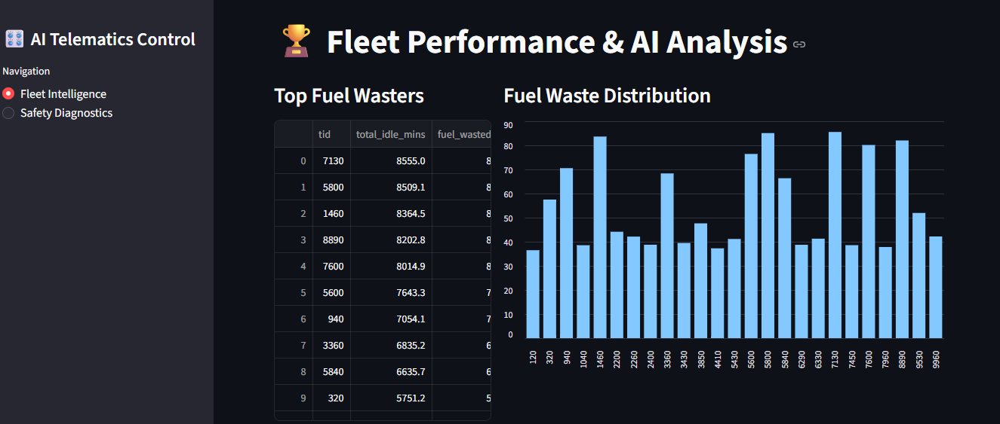
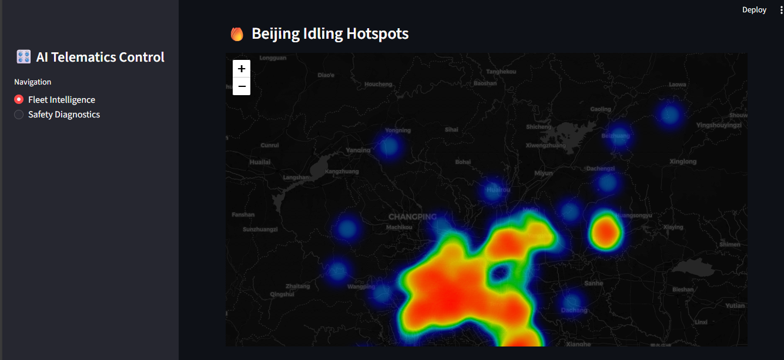
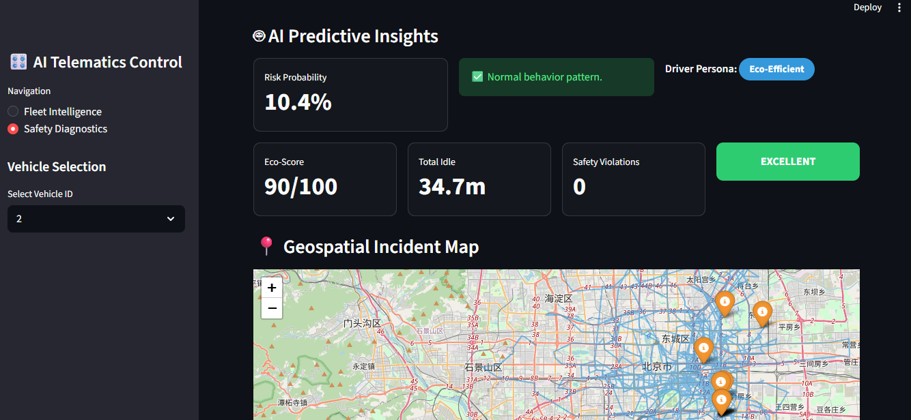
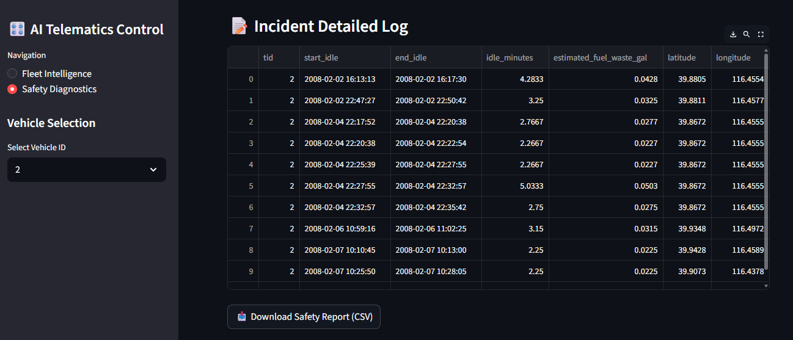

# EcoDrive — Fleet Safety & Telematics Analytics  

## 📌 Overview  

**EcoDrive** is a data-driven telematics analytics platform that transforms large-scale GPS trajectory data into **safety risk scores, behavioral insights, and geospatial intelligence**.

Built on the **[Microsoft T-Drive Taxi Trajectory dataset](https://www.microsoft.com/en-us/research/publication/t-drive-trajectory-data-sample/) (17.5M+ GPS pings from 10,247 vehicles)**, EcoDrive combines **spatial mathematics, machine learning, optimized data pipelines, and real-time visualization** to simulate production-grade fleet monitoring systems.

---

## 📐 Spatial Distance Modeling
To accurately process **17.5 million GPS points**, EcoDrive applies the **Haversine formula** to compute great-circle distances between consecutive GPS coordinates.

This enables:
- Vehicle displacement calculation  
- Stop and idle detection  
- GPS noise filtering  
- Precise identification of idling hotspots  

**Distance calculation:**

d = 2r · arcsin( √(sin²((φ₂ − φ₁) / 2)+ cos(φ₁) · cos(φ₂) · sin²((λ₂ − λ₁) / 2)))

Where:
- φ₁, φ₂ — Latitude of point 1 and point 2 (radians)  
- λ₁, λ₂ — Longitude of point 1 and point 2 (radians)  
- r — Radius of Earth (6,371 km)  
---

## 🚀 Key Capabilities  

- Processes **17,527,705 GPS records** across **10,247 vehicles**  
- Detects idling behavior using spatial threshold logic  
- Real-time dashboard analytics using SQL Views and deterministic sampling  
- Hybrid AI system combining ML predictions with rule-based safety logic  
---

## 🧠 Machine Learning Suite  

### 🤖 Risk Classification (Supervised)  

**Random Forest Classifier** predicts probability of unsafe or inefficient driving behavior.

---

### 📉 Anomaly Detection (Unsupervised)  

**Isolation Forest** identifies behavioral outliers that deviate from fleet norms.

---

### 🧠 Driver Segmentation (Clustering)  

**K-Means Clustering** groups drivers into:

- Eco-Efficient  
- Moderate Idlers  
- High-Waste / High-Risk
  
---

## 🛡️ Safety Override Logic  

Fail-safe enforcement logic ensures operational reliability:

If:
- Eco Score < **40/100**
  
Then:
- Risk probability automatically escalated  
- Driver flagged as **Critical Outlier**  
- Priority dashboard alert triggered
  
---

## 📊 Dashboard Features  

### 🚨 Incident Log & CSV Export  

- Auto-generated **incident log per vehicle**  
- Records high-risk events, idling violations, and anomaly flags  
- Supports **CSV export** for offline analysis, reporting, and audits
  
---

## 📸 Project Gallery  
| Top 10 Fuel Wasters | Idling Hotspot Map |
|--------------------|-------------------|
|  |  |

---

| Performance Metrics | Incident Log |
|---------------------|--------------|
|  |  |

---

## 🛠️ Technology Stack  

**Dashboard:** Streamlit  
**Database:** SQLite3 (Indexed)  
**ML & Analytics:** Scikit-Learn, Pandas, NumPy  
**Visualization:** Folium, Streamlit-Folium, Matplotlib  
**Model Storage:** Joblib  

---

## ⚡ Quick Start  

### 1️⃣ Installation  

```bash
git clone https://github.com/Vaishnavi-Venkataraman/EcoDrive.git
cd EcoDrive
pip install -r requirements.txt
````

---

### 2️⃣ Train Models

```bash
python src/predictive_analytics.py
```

---

### 3️⃣ Launch Dashboard

```bash
streamlit run app.py
```

Access locally:

```
http://localhost:8501
```